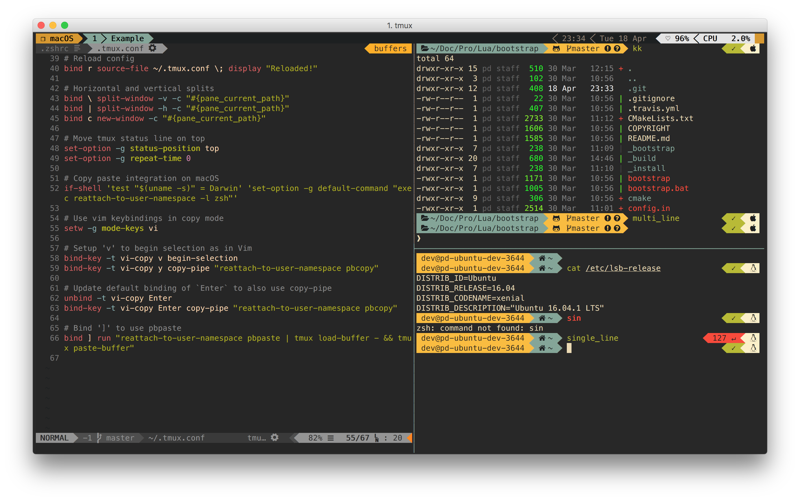

Basic dotfiles for Tmux, Vim and Zsh
------------------------------------



My personal dotfiles used with Vim, Tmux and Zsh on OSX and Linux.

Install on Mac and Linux
------------------------

```bash
git clone https://github.com/drahosp/dotfiles ~/.dotfiles
cd ~/.dotfiles && ./install.sh
chsh -s /bin/zsh # if needed
```

Plugin maintanance
------------------

After installation each tool will install its own dependencies automatically when run.

To force Tmux to update all plugins use `Ctrl+A I`.

To update Zsh plugins use `zplug update`

To update Vim plugins use `:PlugUpdate`
